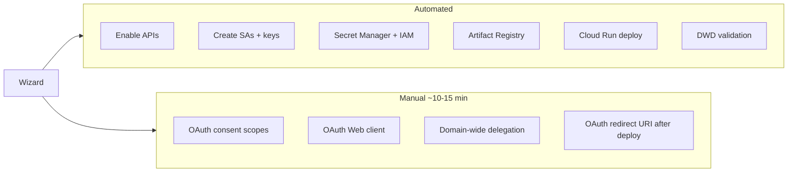

# New Tenant Deployment — Cloud Shell Wizard

One-command greenfield setup for Google Workspace Admin Assist. Automates all GCP provisioning, guides Google Workspace Admin steps with deep links, validates domain-wide delegation, and deploys to Cloud Run.

**Time:** ~20–30 minutes (10–15 min is unavoidable manual OAuth + DWD in consoles).

---

## Prerequisites

| Requirement | Who |
|-------------|-----|
| Google Workspace **Super Admin** | Signs in to admin.google.com for DWD |
| GCP **Project Owner** or equivalent | Runs wizard in Cloud Shell |
| Billing enabled on project (or billing account ID ready) | GCP Billing Admin |
| GitHub repo access (optional) | For CI secrets via `gh` CLI |

---

## One command (Cloud Shell)

[](https://shell.cloud.google.com/cloudshell/editor?cloudshell_git_repo=https://github.com/joemartinxiii/GWS_AdminAssist.git&cloudshell_open_in_editor=true&cloudshell_working_dir=GWS_AdminAssist)

After Cloud Shell opens:

```bash
cd GWS_AdminAssist
bash scripts/bootstrap-tenant.sh \
  --domain yourcompany.com \
  --project your-gcp-project \
  --admin you@yourcompany.com
```

**New GCP project:**

```bash
bash scripts/bootstrap-tenant.sh \
  --create-project \
  --billing-account 012345-678901-ABCDEF \
  --domain yourcompany.com \
  --project workspace-admin-prod \
  --admin you@yourcompany.com
```

---

## What the wizard automates vs what you click



| Step | Automated? | Where |
|------|------------|-------|
| Link billing | Conditional | Wizard prompts or `--billing-account` |
| Enable APIs | Yes | `gcloud services enable` |
| `workspace-admin-sa` + `github-deploy-sa` | Yes | IAM + keys → Secret Manager |
| Secret Manager IAM bindings | Yes | Previously manual in setup-secrets.sh |
| OAuth consent + Web client | **No** | GCP Console — wizard opens links + copy-paste |
| Domain-wide delegation | **No** | admin.google.com — wizard prints client_id + scopes |
| First Cloud Run deploy | Yes | Cloud Build via `deploy-cloudshell.sh` |
| GitHub secrets | Optional | `gh secret set` or paste instructions |
| DWD smoke test | Yes | Impersonates admin, lists 1 user |
| Health check | Yes | `GET /health` |

---

## Wizard phases

1. **Preflight** — gcloud auth, project exists, billing check
2. **GCP provision** — APIs, service accounts, secrets, Artifact Registry
3. **OAuth (guided)** — consent screen + Web client; paste Client ID/Secret
4. **DWD (guided)** — admin.google.com link; validates with live API call
5. **Deploy** — Cloud Shell deploy first, then optional GitHub Actions setup
6. **Summary** — service URL, redirect URI, role expectations

### Options

```
--create-project       Create GCP project
--billing-account ID   Link billing
--organization ID      Org for new project
--folder ID            Folder for new project
--region REGION        Default us-central1
--skip-cloudshell      Skip immediate deploy
--skip-github          Skip GitHub secrets
--non-interactive      Requires CLIENT_ID, CLIENT_SECRET, --billing-account env/flags
--github-repo OWNER/REPO  For gh secret set
```

---

## Scope strings (single source of truth)

DWD scopes live in [`scripts/lib/scopes.sh`](../scripts/lib/scopes.sh) and must match [`backend/src/config/google.config.ts`](../backend/src/config/google.config.ts).

Verify sync:

```bash
npm run check:scopes
```

---

## Verification

After bootstrap:

```bash
# Health
curl -s "$(gcloud run services describe workspace-admin --region us-central1 --format='value(status.url)')/health"

# DWD only (if troubleshooting)
npx tsx scripts/verify-dwd.ts /path/to/sa-key.json you@yourcompany.com

# Read-only live tests (optional, requires .env.test)
npm run bootstrap:test
npm run test:live:read
```

---

## Ongoing deploys

After first setup:

1. **Push to `main`** — GitHub Actions deploys automatically, or
2. **Actions → Deploy to Cloud Run → Run workflow**

Cloud Shell redeploy:

```bash
bash scripts/deploy-cloudshell.sh your-gcp-project us-central1
```

---

## Full teardown (demo / from-scratch rebuild)

Use this when you want to **wipe the app from GCP** and rebuild with the bootstrap wizard — e.g. to record a setup walkthrough.

### Step 1 — GCP (automated)

In Cloud Shell or locally:

```bash
cd GWS_AdminAssist
bash scripts/teardown-project.sh --project admin-assist-492920
```

Type the project ID when prompted. This removes:

- Cloud Run service `workspace-admin`
- All 7 Secret Manager secrets
- Service accounts `workspace-admin-sa` and `github-deploy-sa`
- Artifact Registry repo `workspace-admin-repo`

**Optional — delete the entire GCP project** (true greenfield; billing account can be re-linked on recreate):

```bash
bash scripts/teardown-project.sh --project admin-assist-492920 --delete-project
```

Project deletion is async; wait a few minutes before reusing the same project ID.

### Step 2 — Google Workspace (manual, ~2 min)

| Action | Link |
|--------|------|
| Remove **domain-wide delegation** entry for the old service account `client_id` | [admin.google.com → DWD](https://admin.google.com/ac/owl/domainwidedelegation) |

The old `client_id` is the numeric ID from the previous SA key (not the OAuth web client ID). If you deleted the SA, check your old `sa-key.json` or Secret Manager version history before teardown.

### Step 3 — OAuth (manual, ~2 min)

| Action | Link |
|--------|------|
| Delete the OAuth **Web application** client (or clear redirect URIs if reusing) | [GCP Credentials](https://console.cloud.google.com/apis/credentials?project=admin-assist-492920) |

Consent screen configuration can stay — the wizard reuses or extends it.

### Step 4 — GitHub (manual, ~1 min)

Remove or clear Actions secrets so the demo starts clean:

- `GCP_PROJECT_ID`
- `GCP_SA_KEY`

[GitHub → Settings → Secrets → Actions](https://github.com/joemartinxiii/GWS_AdminAssist/settings/secrets/actions)

### Step 5 — Local machine (optional)

```bash
rm -f sa-key.json .env.test   # stale credentials
```

### Step 6 — Rebuild from scratch

**Same project ID** (after teardown without `--delete-project`):

```bash
bash scripts/bootstrap-tenant.sh \
  --domain befree.wtf \
  --project admin-assist-492920 \
  --admin joe@befree.wtf \
  --github-repo joemartinxiii/GWS_AdminAssist
```

**Brand-new project** (after `--delete-project` or for a fresh ID):

```bash
bash scripts/bootstrap-tenant.sh \
  --create-project \
  --billing-account YOUR_BILLING_ACCOUNT_ID \
  --domain befree.wtf \
  --project admin-assist-492920 \
  --admin joe@befree.wtf \
  --github-repo joemartinxiii/GWS_AdminAssist
```

List billing accounts: `gcloud billing accounts list`

---

## Rollback (partial)

For a quick rollback without full demo teardown:

```bash
bash scripts/teardown-project.sh --project YOUR_PROJECT_ID
```

Or delete only Cloud Run:

```bash
gcloud run services delete workspace-admin --region us-central1 --quiet
```

---

## Troubleshooting

| Symptom | Fix |
|---------|-----|
| `unauthorized_client` on DWD test | Use SA `client_id` (numeric), not OAuth web client ID. Scopes must match `scopes.sh`. Wait 1–5 min after saving. |
| SA key creation blocked | Org policy `iam.disableServiceAccountKeyCreation` — use [Workload Identity Federation](GITHUB_ACTIONS.md) |
| OAuth login fails | Redirect URI must exactly match Cloud Run URL + `/api/auth/callback` |
| Billing not enabled | `--billing-account` or link in GCP Console |
| Scope drift | Run `npm run check:scopes` |

---

## Legacy path

Existing scripts still work:

- [`setup-secrets.sh`](../setup-secrets.sh) — secrets only (now auto-applies IAM)
- [`deploy.sh`](../deploy.sh) — local Docker deploy (optional)
- [`DEPLOYMENT.md`](../DEPLOYMENT.md) — original deployment guide

For new tenants, start here instead.
